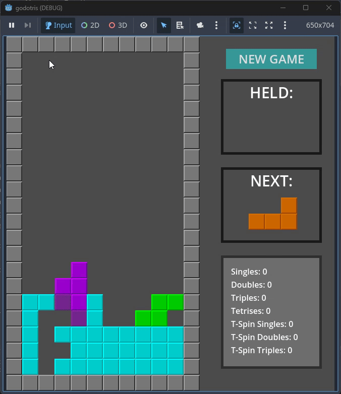

# Godotris
Recreating Tetris in Godot

Tutorial used: https://www.youtube.com/watch?v=2T2Fkzwf6FM

# Planned Features

- [x] Ghost piece
- [x] Hard drop 
- [x] More precise controls
- [x] Held pieces
- [x] Wall kicking
- [ ] Buffer window before sticking a piece
- [ ] Accurate line clear/T-spin detection
- [ ] Combo detection
- [ ] Audio/Visual effects (maybe)

